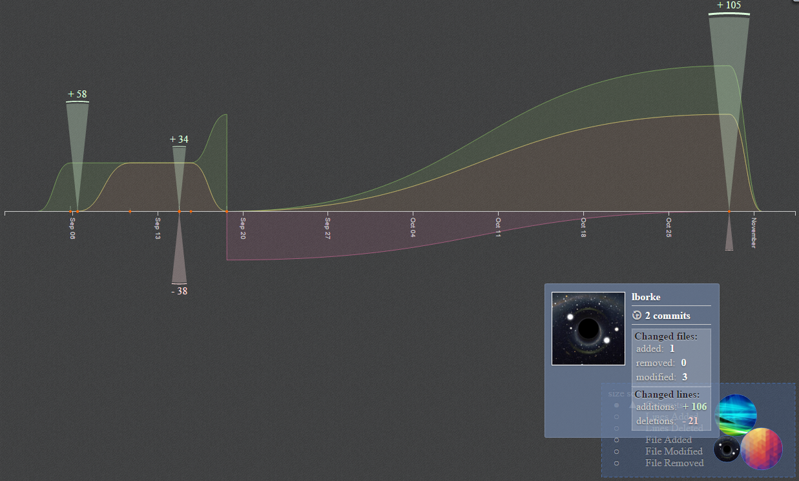
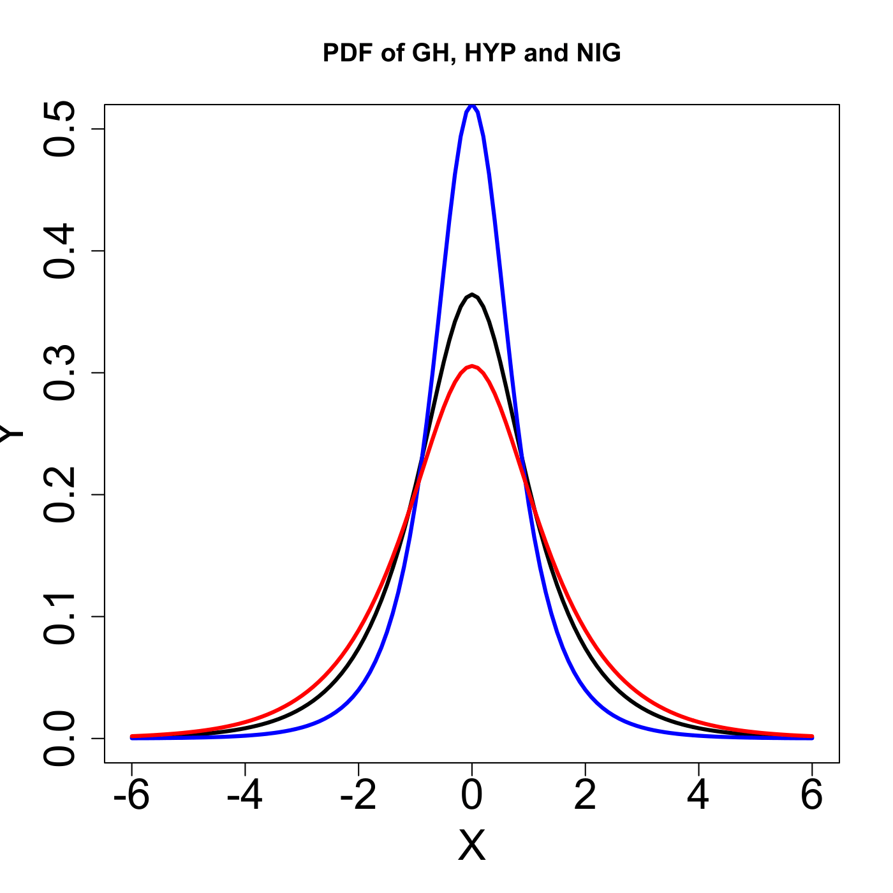

##  **MVAghdis**


### Collaboration Timeline



```yaml
Name of QuantLet : MVAghdis

Published in : Applied Multivariate Statistical Analysis

Description : 'Plots three probability density functions 
(top) and three cumulative density functions (bottom) 
of the GH, Hyperbolic and NIG distributions'

Keywords : 
- pdf
- cdf
- hyperbolic
- plot
- graphical representation
- multivariate
- density
- probability
- distribution
- heavy-tailed

See also : 
- MVAghdistail
- MVAghadatail

Author : Wolfgang K. Haerdle
Submitted : Sun, January 29 2012 by Dedy Dwi Prastyo

```





```R

# clear variables and close windows
rm(list = ls(all = TRUE))
graphics.off()

# install and load packages
libraries = c("VGAM", "fBasics")
lapply(libraries, function(x) if (!(x %in% installed.packages())) {
    install.packages(x)
})
lapply(libraries, library, quietly = TRUE, character.only = TRUE)

# PDF of Generalised Hyperbolic Distribution
xx = seq(-6, 6, by = 0.1)
plot(xx, dgh(xx, alpha = 1, beta = 0, delta = 1, mu = 0, lambda = 0.5), type = "l", 
    ylim = c(0, 0.5), ylab = "Y", xlab = "X", col = "black", lwd = 3, cex.lab = 2, 
    cex.axis = 2)
lines(xx, dnig(xx, alpha = 1, beta = 0, delta = 1, mu = 0), type = "l", col = "blue", 
    lwd = 3)
lines(xx, dhyp(xx, alpha = 1, beta = 0, delta = 1, mu = 0, pm = c("1", "2", "3", 
    "4")), type = "l", col = "red", lwd = 3)
legend(x = 8, y = 0.3, legend = c("GH", "NIG", "HYP"), pch = c(20, 20), col = c("black", 
    "blue", "red"), bty = "n")
title("PDF of GH, HYP and NIG")

# CDF of Generalised Hyperbolic Distribution
dev.new()
plot(xx, pgh(xx, alpha = 1, beta = 0, delta = 1, mu = 0, lambda = 0.5), type = "l", 
    ylab = "Y", xlab = "X", col = "black", lwd = 3, cex.lab = 2, cex.axis = 2)
lines(xx, pnig(xx, alpha = 1, beta = 0, delta = 1, mu = 0), type = "l", col = "blue", 
    lwd = 3)
lines(xx, phyp(xx, alpha = 1, beta = 0, delta = 1, mu = 0, pm = c("1", "2", "3", 
    "4")), type = "l", col = "red", lwd = 3)
legend(x = 8, y = 0.6, legend = c("GH", "NIG", "HYP"), pch = c(20, 20), col = c("black", 
    "blue", "red"), bty = "n")
title("CDF of GH, HYP and NIG") 

```
